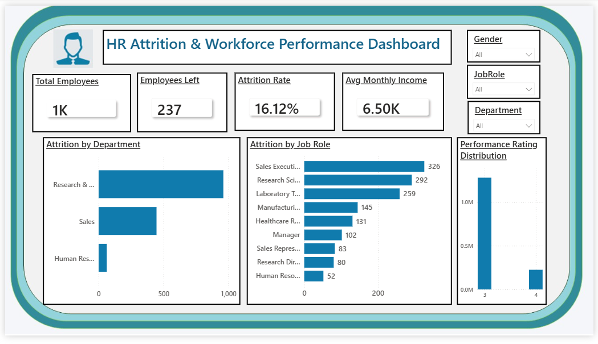

# HR Attrition & Workforce Analytics Dashboard

## Overview
This project combines HR analytics, Excel-based data analysis,
and Power BI dashboarding to analyze employee attrition and
workforce performance.

It is supported by a real-world SAP SuccessFactors case study
to demonstrate enterprise HR transformation and analytics use cases.

## Business Problem
Organizations face challenges such as:
- High employee attrition
- Fragmented HR processes
- Limited workforce visibility
- Inconsistent reporting across departments and regions

This project addresses these challenges using analytics and dashboards
to support data-driven HR decision-making.

## Dashboard
The interactive Power BI dashboard is available in the `Dashboard` folder
as a `.pbix` file. A static preview image is also provided.

## Key Dashboard Insights

- The overall employee attrition rate stands at **16.12%**, indicating a
  meaningful opportunity for improved retention strategies.

- **Research & Development** and **Sales** departments account for the
  highest number of employee exits, suggesting department-level attrition
  concentration.

- Certain roles, such as **Sales Executives** and **Research Scientists**,
  experience higher attrition volumes, which may indicate role-specific
  workload or engagement factors that warrant further investigation.

- The performance rating distribution shows most employees clustered at
  **Rating 3**, with fewer employees achieving **Rating 4**, suggesting
  potential opportunities for performance development and talent growth.

- The average monthly income is approximately **6.5K**. While the dashboard
  does not directly link compensation to attrition, income trends can be
  analyzed further alongside attrition data to assess compensation
  competitiveness.

- Attrition patterns vary across departments and job roles, reinforcing
  the need for targeted, data-driven workforce strategies rather than
  generalized retention approaches.

## Recommendations

- Prioritize retention analysis and interventions in **Sales** and
  **Research & Development** departments, where attrition volumes
  are highest.

- Conduct deeper role-level assessments for positions with higher
  attrition to understand potential workload, engagement, or
  organizational factors.

- Introduce structured learning and development initiatives to
  support employee growth and progression across performance rating levels.

- Review compensation structures periodically, particularly for
  high-attrition roles, to ensure alignment with market standards
  and internal equity.

- Enhance workforce analytics by combining performance, compensation,
  and attrition data to enable more granular, evidence-based insights.

- Leverage HR dashboards regularly in leadership reviews to support
  proactive workforce planning and data-driven decision-making.

## Excel-Based Analysis
Detailed HR data analysis was performed using Microsoft Excel,
including pivot tables and distributions:
- Attrition by Department
- Performance Rating Distribution
- Gender Distribution

Excel files and analysis screenshots are available in the `Data_Analysis` folder.

## Case Study Documentation
The project is supported by detailed SAP SuccessFactors documentation,
available in the `Case_Study_Documentation` folder, including:
- SAP_SuccessFactors_Employee_Central_Case_Study_Background
- AS_IS_vs_TO_BE_HR_Process_Overview
- SAP_SuccessFactors_Employee_Central_Functional_Overview
- SAP_SuccessFactors_Talent_Modules_Functional_Overview
- Compensation_Management_and_System_Integration_Overview

## Tools & Skills Used
- Power BI (Dashboarding)
- Microsoft Excel (Pivot Tables, HR Analysis)
- HR Analytics & Workforce Insights
- Business Process Analysis
- SAP SuccessFactors (Conceptual / Case Study)

## Author
Abhishek
